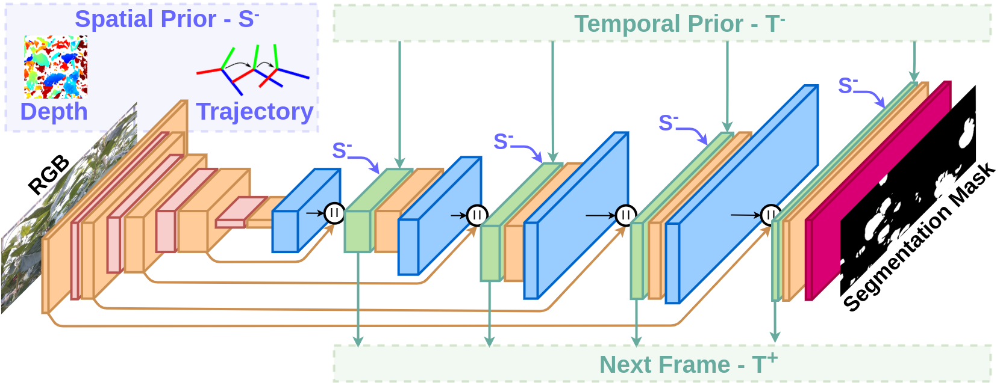
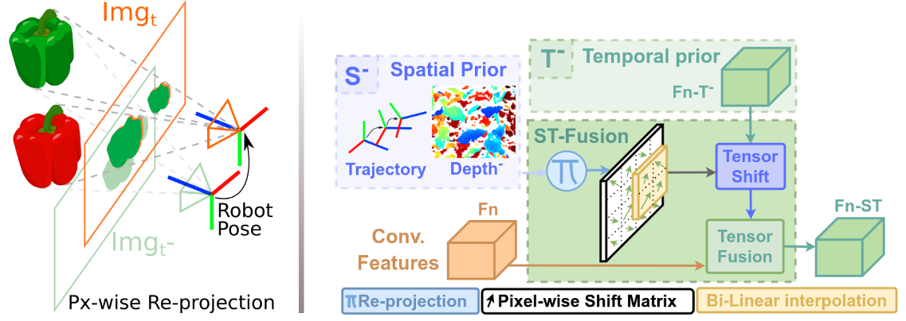
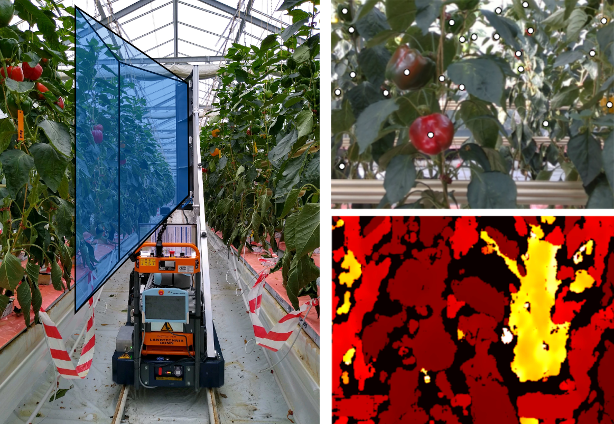
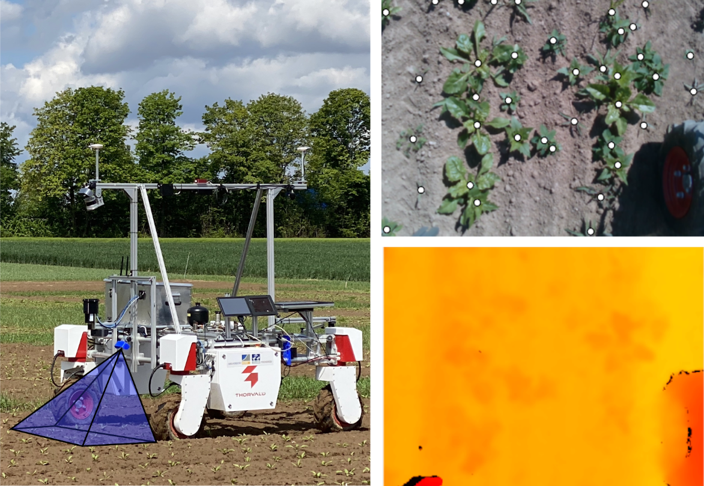

# Spatial-Temporal DNN for Agriculture (ReprojRNN)


### [Paper](https://arxiv.org/pdf/2206.13406.pdf) | [Data](http://agrobotics.uni-bonn.de/data/)

[Explicitly incorporating spatial information to recurrent networks for agriculture](https://arxiv.org/pdf/2206.13406.pdf)  
 [**Claus Smitt**](http://agrobotics.uni-bonn.de/claus-g-smitt/),
 [Michael Halstead](http://agrobotics.uni-bonn.de/michael-halstead/),
 [Alireza Ahmadi](http://agrobotics.uni-bonn.de/alireza-ahmadi/),
 [Chris McCool](https://sites.google.com/site/christophersmccool/)
 
 [Agricultural Robotics & Engineering](http://agrobotics.uni-bonn.de/),
 Institute of Agriculture, University of Bonn

Presented at IROS 2022 (**Best AgRobotics Paper Winner!**)



**ReprojRNN** leverages spatial-temporal cues available in most agricultural robots to improve crop monitoring tasks. 

## TL;DR - Test Pre-Trained model

```
python3 -m venv ".venv"
. .venv/bin/activate

pip install --upgrade pip
pip install -r requirements.txt

bash scripts/get_bup20.sh                 # ~70GB
bash scripts/get_st_atte_model_bup20.sh   # ~500MB

python test.py \
  trained_models/st_atte_bup20/config.yaml \
  -g 1 \
  --data_path ~/datasets/CKA_sweet_pepper_2020_summer/CKA_sweet_pepper_2020_summer.yaml

```

If all went well, you should get the list of all metrics when the model finishes testing.

**Note**: Change the torch version in the `requirements.txt` file according to your CUDA version in case you get version errors

## Under the hood
We propose a Spatial-Temporal fusion layer (ST-Fusion) that spatially registers feature maps throughout a sequence of frames.
It leverages spatial-temporal information commonly available in agricultural robots (RGB-D images & robot poses) and leverages multi-view geometry to re-project complete tensors between frames, at any given depth of a deep convolutional neural network.  



This layer computes a pixel-wise shift matrix using the depth image from a previous frame and robot trajectory (S<sup>-</sup> Spatial Prior).

Moreover, since it is desirable to fuse information at different scales fo the network, the shift matrix can be interpolated to the corresponding tensor size to perform registration (see our [paper](https://arxiv.org/pdf/2206.13406.pdf) for more details). This matrix is used to register a prior recurrent feature map (T<sup>-</sup> Temporal Prior) to the feature maps of the current frame, which can then finally be fused together.

In this repository the available tensor fusion methods are [px-wise attention](https://arxiv.org/abs/1808.03833) (`models/rnn_avg_attention_reproj_segmentation`) and [Conv-GRUs](https://arxiv.org/abs/1511.06432) (`models/gru_reproj_segmentation`).

Finally instances of the ST-Fusion layer are interleaved in a fully convolutional segmentation pipeline at various depths of it's decoder, explicitly incorporating the Spatial-Temporal information to the mask predictions.

## Setup

Tested on Ubuntu 18.06; CUDA 11.3

### Pre-requisites
```
sudo apt-get update
sudo apt-get -y upgrade
sudo apt-get install -y python3-pip
sudo apt-get install build-essential libssl-dev libffi-dev python-dev
sudo apt-get install -y python3-venv
```

Install [CUDA and cuDDN](https://docs.nvidia.com/deeplearning/cudnn/install-guide/index.html).

### Python virtual environment setup

```
python3 -m venv ".venv"
. .venv/bin/activate
pip install --upgrade pip
pip install -r requirements.txt
```

### Training details

We train our models with sequences of N frames as samples, and a batch is a set of these sequences. These include RGB-D images and associated camera/robot odometry. A limitation of temporal models is that they are generally trained and evaluated on consistent framerates. However, real-world systems need to deal with variable framerate as well as frame drops and jitter. Therefore, we train our models on sequences with artificial frame drops and jitter with monotonously increasing indices (see our [paper](https://arxiv.org/pdf/2206.13406.pdf) for more details).
## Datasets used
We evaluate our ST-Fusion layer by inserting them on segmentation tasks segmentation task in two challenging agricultural datasets:

### Horticulture glasshouse - sweet pepper ([BUP20](http://agrobotics.uni-bonn.de/sweet_pepper_dataset/))

Donwload the dataset (~70GB):
```
bash scripts/get_sb20.sh
```

A dataset consisting of video sequences from a glasshouse environment in campus Klein-Altendorf (CKA), with two sweet pepper cultivar *Mavera* (yellow) and *allrounder* (red), each cultivar matured from green, to mixed, to their primary color.This data, which contains all the colors, was captured by the autonomous phenotyping platform [PATHoBot](https://arxiv.org/abs/2010.16272) driving at 0.2 m/s.
The dataset comprises 10 sequences of 6 crop-rows, captured using Intel RealSense D435i cameras recording RGB-D images, as well as wheel & RGB-D refined odometry.

Below is a summary of the dataset characteristics

| Image size | Images type | Robot Pose | FPS | Train | Val.  | Eval. |
|------|---|---|---|---|--|--|
|      1280 x 720| RGB-D | wheel & RGB-D odometry | 15  |  124 | 62  | 93  |



### Arable farming - sugar beet ([SB20](http://agrobotics.uni-bonn.de/sugar_beet2020/))

Download the dataset (~9GB):
```
bash scripts/get_sb20.sh
```

This dataset was captured at a sugar beet field in CKA of the University of Bonn using an Intel RealSense D435i camera with a nadir view of the ground mounted on [BonnBot-I](https://arxiv.org/abs/2109.11936) driving at 0.4 m/s. 

Sequences contain robot wheel odometry and RGB-D images of crops and 8 different categories of weeds at different growth stages, different illumination conditions and three herbicide treatment regimes (30%, 70%, 100%), impacting weed density directly. 

Below is a sumary of the dataset characteristics

| Image size | Images type | Robot Pose | FPS | Train | Val.  | Eval. |
|------|---|---|---|---|--|--|
|      640 x 480| RGB-D | wheel & RGB-D odometry | 15  |  71 | 37  | 35  |




## Train your own model

Folder `./config` has several `yaml` config examples used in the paper that can be used as examples
```
python train.py \  
  -g [num_gpus] \
  --out_path /net/outputs/save/path
  --log_path /train/logs/save/path
  --ckpt_path /model/checkpoints/save/path
  --data_path /dataset/yaml/file/location
```
The training script uses [`PytorchLightning` DDP](https://pytorch-lightning.readthedocs.io/en/1.4.0/advanced/multi_gpu.html#distributed-data-parallel) plugin for multi GPU training.

**Note**: The training process is quite memory intensive due to the recurrent nature of the models (trained on Nvidia RTX A6000). In case you get an out of memory error, try making the following changes to your `yaml` config file:
  - Reduce `dataloader/batch_size`
  - Reduce `dataloader/sequencing/num_frames` to use shorter frame sequences
  - Set `/trainer/precision` to 16 

This would likely give you different results from the ones reported in the paper but you'll be able to train the model on you own.

<!-- ### Prepare your own dataset -->
<!-- One easy way to  -->
## Citation
```
@article{smitt2022explicitly,
  title={Explicitly incorporating spatial information to recurrent networks for agriculture},
  author={Smitt, Claus and Halstead, Michael and Ahmadi, Alireza and McCool, Chris},
  journal={IEEE Robotics and Automation Letters},
  year={2022},
}
```
